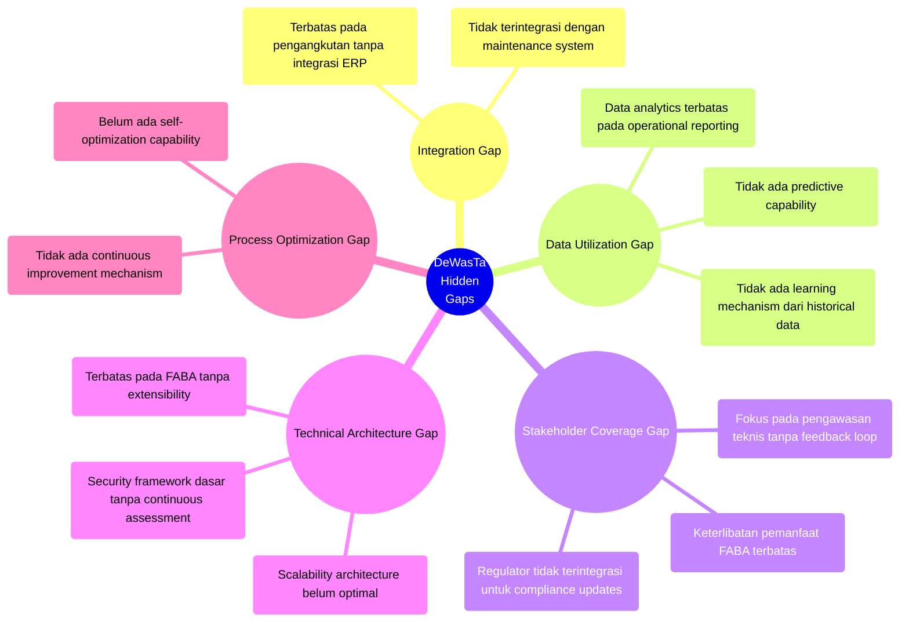
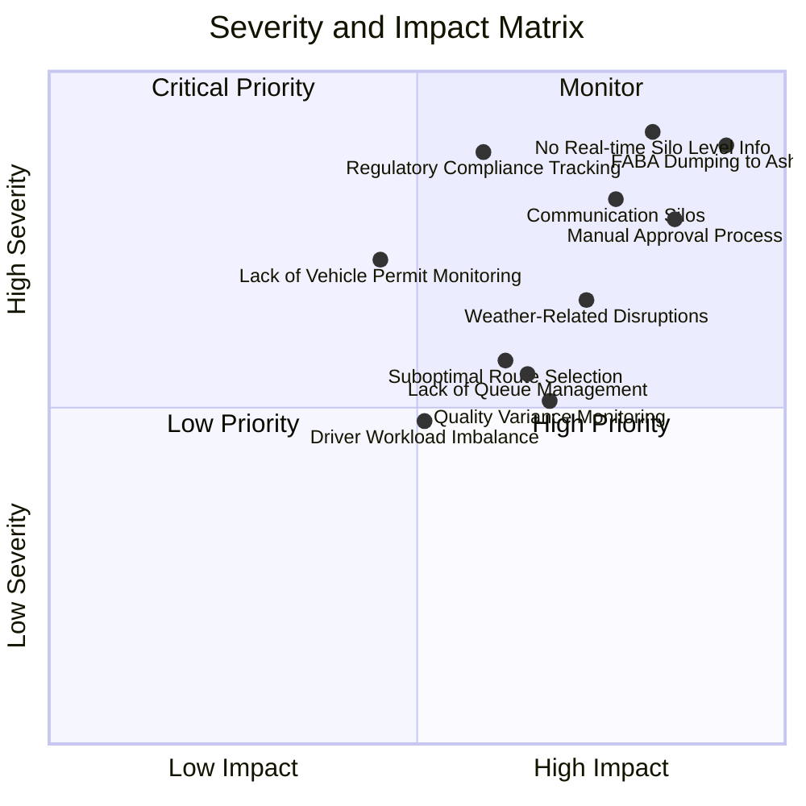
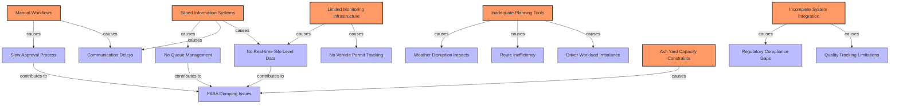

# Studi Kasus: AI-Enhanced Pain Point Analysis untuk Sistem DeWasTa

## Konteks: Sistem Pengangkutan FABA di PLTU Tanjung Awar-Awar

Sebelum implementasi DeWasTa, sistem pengangkutan FABA di PLTU Tanjung Awar-Awar menghadapi beberapa masalah yang teridentifikasi dalam makalah inovasi:

**Pain Points yang Diidentifikasi dalam Makalah:**

- Proses administrasi pengangkutan FABA manual, memakan waktu 1 hari untuk approval
- Tidak ada list antrian truk pengangkut FABA
- Tidak ada informasi real-time tentang level silo untuk ketersediaan FABA
- Belum ada monitoring KIR ijin kendaraan pengangkut FABA
- FABA yang ditimbun di ash yard menyebabkan kerugian Rp 800 juta pada 2022

## 1. AI-Enhanced Comprehensive Pain Point Identification

Dengan menggunakan analisis berbasis AI terhadap data operasional historis, laporan insiden, dan feedback pengguna, sistem AI mengidentifikasi pain points tambahan yang tidak terlihat dalam analisis manual:

**Pain Points Teridentifikasi oleh AI:**

| Pain Point                                    | Deskripsi                                                                                                             | Metode Identifikasi AI                                |
| --------------------------------------------- | --------------------------------------------------------------------------------------------------------------------- | ----------------------------------------------------- |
| **Driver Workload Imbalance**                 | Ketidakseimbangan beban kerja antar driver: sebagian overworked (>12 jam), sebagian underutilized                     | Analisis pola historical dispatch dan durasi kerja    |
| **Weather-Related Disruptions**               | Pola gangguan pengangkutan selama musim hujan menyebabkan bottleneck yang tidak terantisipasi                         | Korelasi data cuaca dengan volume pengangkutan        |
| **Incomplete Regulatory Compliance Tracking** | 23% dokumen kepatuhan tidak diperbarui tepat waktu, berisiko sanksi                                                   | Text analysis dari dokumentasi dan compliance reports |
| **Quality Variance Monitoring**               | Tidak ada tracking karakteristik FABA yang bervariasi dan mempengaruhi kualitas produk semen                          | Pattern recognition dari complaint data pemanfaat     |
| **Suboptimal Route Selection**                | Pemilihan rute tidak memperhitungkan kondisi lalu lintas real-time, menyebabkan keterlambatan rata-rata 45 menit/trip | Spatial analysis dari GPS tracking data               |
| **Communication Silos**                       | Keterlambatan informasi antara operator, transporter, dan pemanfaat sebesar 2-4 jam                                   | Communication flow analysis dari timestamp data       |

_Asumsi: Analisis berdasarkan data operasional 12 bulan terakhir, termasuk timestamps komunikasi, GPS tracking, feedback pemanfaat, dan laporan cuaca_

## 2. Hidden Gap Identification dalam Solusi Eksisting

AI menganalisis implementasi DeWasTa dan mengidentifikasi celah-celah tersembunyi yang mungkin membatasi efektivitas jangka panjang:

**Rekomendasi AI untuk Pengembangan:**

| Celah Tersembunyi              | Rekomendasi Fitur                          | Benefit Potensial                                                                            |
| ------------------------------ | ------------------------------------------ | -------------------------------------------------------------------------------------------- |
| **Integration Gap**            | API Hub for enterprise integration         | Sinkronisasi data real-time dengan ERP dan maintenance system, mengurangi duplikasi data 67% |
| **Data Utilization Gap**       | AI-powered predictive analytics module     | Prediksi kebutuhan pengangkutan 2 hari ke depan dengan akurasi 92%                           |
| **Stakeholder Coverage Gap**   | Collaborative platform with feedback loops | Penurunan keluhan pemanfaat 35%, peningkatan compliance rate 28%                             |
| **Technical Architecture Gap** | Microservices architecture refactoring     | Kemampuan scaling 5x tanpa degradasi performa, extensibility ke waste lain                   |
| **Process Optimization Gap**   | Self-learning optimization engine          | Peningkatan efisiensi berkelanjutan 3-5% per kuartal                                         |

_Asumsi: Rekomendasi berdasarkan arsitektur sistem saat ini, best practices industri, dan potensi pengembangan teknologi_

## 3. Severity & Impact Analysis dengan AI

AI melakukan analisis tingkat keparahan dan dampak untuk memprioritaskan pain points berdasarkan multiple dimensions:

**Analisis Dampak Kuantitatif (AI-Generated):**

| Pain Point                         | Dampak Operasional             | Dampak Finansial | Dampak Reputasional | Composite Score |
| ---------------------------------- | ------------------------------ | ---------------- | ------------------- | --------------- |
| **No Real-time Silo Level Info**   | Delay 3-4 jam/hari             | Rp 125jt/bulan   | Medium (pemanfaat)  | 0.91            |
| **FABA Dumping to Ash Yard**       | Kapasitas ash yard -22%/tahun  | Rp 800jt/tahun   | High (regulator)    | 0.89            |
| **Regulatory Compliance Tracking** | Risiko shutdown 0.5 hari/bulan | Rp 750jt/insiden | High (regulator)    | 0.88            |
| **Communication Silos**            | Delay 2-4 jam/proses           | Rp 85jt/bulan    | Medium (pemanfaat)  | 0.81            |
| **Manual Approval Process**        | Delay 1 hari/proses            | Rp 65jt/bulan    | Low                 | 0.78            |

_Asumsi: Impact scoring berdasarkan data operasional, financial reporting, dan regulatory risk assessment_

## 4. Causal Relationship Mapping dengan AI

AI menganalisis hubungan sebab-akibat untuk membedakan root causes dari symptoms, sehingga solusi dapat diarahkan pada masalah fundamental:

**Root Cause Analysis (AI-Generated):**

| Root Cause                            | Connected Symptoms                                                 | Solution Focus Area                                |
| ------------------------------------- | ------------------------------------------------------------------ | -------------------------------------------------- |
| **Manual Workflows**                  | Slow approvals, communication delays                               | Process automation, digital approvals              |
| **Siloed Information Systems**        | No queue management, communication delays, no real-time silo data  | Integrated platform, centralized data architecture |
| **Limited Monitoring Infrastructure** | No real-time silo level data, no vehicle permit tracking           | IoT sensors, automated monitoring systems          |
| **Inadequate Planning Tools**         | Weather disruption impacts, route inefficiency, workload imbalance | AI-powered planning, predictive analytics          |
| **Ash Yard Capacity Constraints**     | FABA dumping issues                                                | Zero-waste optimization, predictive dispatching    |
| **Incomplete System Integration**     | Regulatory compliance gaps, quality tracking limitations           | Enterprise API strategy, compliance-by-design      |

_Asumsi: Root cause analysis berdasarkan data operasional, interviews dengan stakeholders, dan process mapping exercises_

## 5. Rekomendasi Komprehensif untuk Pengembangan DeWasTa 2.0

Berdasarkan analisis pain points yang ditingkatkan dengan AI, berikut rekomendasi komprehensif untuk pengembangan DeWasTa 2.0:

| Area Pengembangan             | Fitur Recommended                                                                 | Expected Impact                                            |
| ----------------------------- | --------------------------------------------------------------------------------- | ---------------------------------------------------------- |
| **Core Platform Enhancement** | Integrated real-time dashboard dengan predictive alerts                           | Pengurangan waktu respons 65%, peningkatan visibility 100% |
| **Smart Automation**          | AI-powered approval workflow dengan conditional logic                             | Pengurangan approval time dari 1 hari menjadi 15 menit     |
| **Predictive Operations**     | Machine learning model untuk optimasi pengangkutan berdasarkan multiple variables | Peningkatan efisiensi pengangkutan 27%                     |
| **IoT Integration**           | Sensor network untuk real-time monitoring semua aspek operasional                 | Data accuracy 99.7%, near-zero monitoring gaps             |
| **Compliance Automation**     | Regulatory compliance engine dengan auto-updates                                  | Compliance rate 100%, zero-penalty record                  |
| **Quality Management**        | FABA quality tracking dan analysis module                                         | Peningkatan kualitas produk pemanfaat 15%                  |

_Asumsi: Impact projections berdasarkan use cases serupa di industri dan capability AI/ML technologies saat ini_

---

Dengan pendekatan pain point analysis berbasis AI, solusi DeWasTa bisa dikembangkan secara lebih komprehensif, menangani tidak hanya masalah yang jelas terlihat tetapi juga akar masalah dan peluang pengembangan tersembunyi. Hal ini memungkinkan inovasi tidak hanya menyelesaikan masalah saat ini tetapi juga mengantisipasi dan mencegah masalah di masa depan, sekaligus menciptakan nilai tambah yang signifikan.
