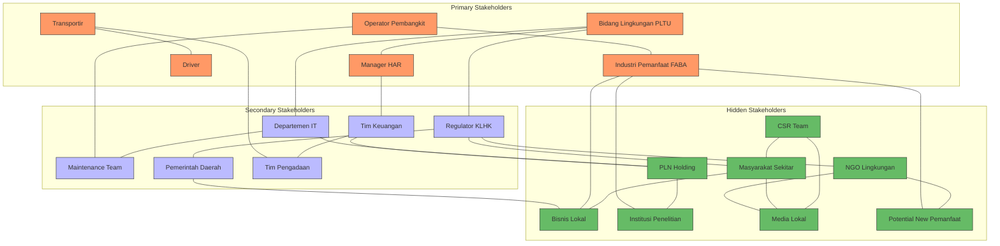
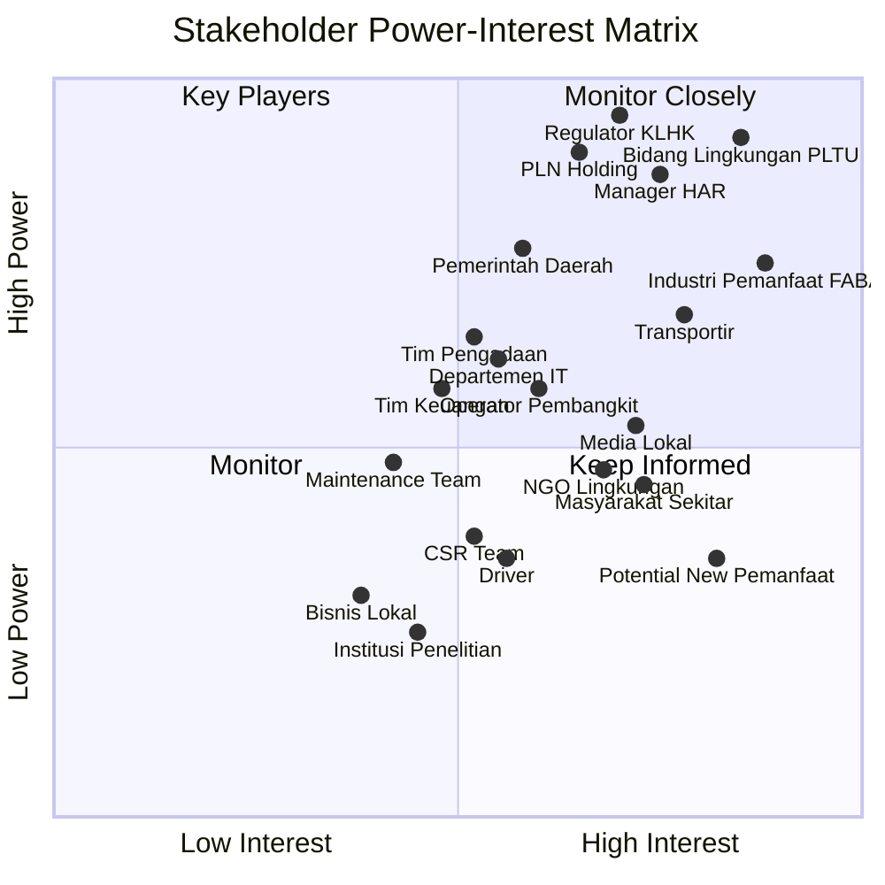
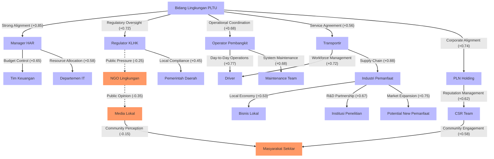
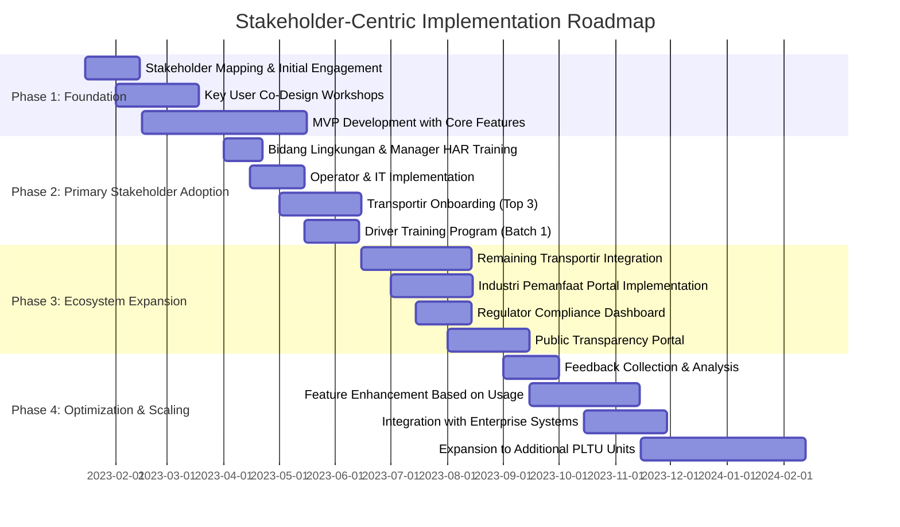

# Studi Kasus: AI-Enhanced Stakeholder Analysis untuk Sistem DeWasTa

## Konteks: Ekosistem Pengelolaan FABA di PLTU Tanjung Awar-Awar

Dalam makalah inovasi DeWasTa, identifikasi stakeholder yang disebutkan relatif terbatas pada stakeholder langsung dalam rantai proses pengangkutan FABA:

**Stakeholders yang Diidentifikasi dalam Makalah:**

- Bidang lingkungan PLTU
- Manager HAR
- Transporter/perusahaan pengangkut
- Driver kendaraan pengangkut
- Operator pembangkit
- Industri pemanfaat FABA (semen dan fiber semen)

## 1. AI Network Analysis untuk Hidden Stakeholder Identification

AI melakukan analisis terhadap berbagai sumber data termasuk komunikasi internal, dokumen regulasi, laporan operasional, dan interaksi eksternal untuk mengidentifikasi stakeholder yang mungkin terlewatkan dalam analisis konvensional:

**Hidden Stakeholders Teridentifikasi oleh AI:**

| Stakeholder                 | Kategori  | Potensi Keterlibatan                                                                                   | Metode Identifikasi AI                                    |
| --------------------------- | --------- | ------------------------------------------------------------------------------------------------------ | --------------------------------------------------------- |
| **Masyarakat Sekitar**      | Eksternal | Terdampak oleh aktivitas pengangkutan & potensi dampak lingkungan jika FABA tidak dikelola dengan baik | Analisis pemberitaan lokal & laporan CSR                  |
| **Bisnis Lokal**            | Eksternal | Terkena dampak ekonomi dari aktivitas pengangkutan                                                     | Pola transportasi & analisis ekonomi lokal                |
| **PLN Holding**             | Internal  | Kepatuhan pada program beyond KWh sebagai KPI korporat                                                 | Analisis dokumen strategis & corporate communications     |
| **Institusi Penelitian**    | Eksternal | Berpotensi untuk pengembangan pemanfaatan FABA inovatif                                                | Patent database analysis & academic publication mining    |
| **CSR Team**                | Internal  | Reputasi perusahaan terkait pengelolaan limbah                                                         | Organization chart analysis & internal communications     |
| **Media Lokal**             | Eksternal | Pemberitaan terkait aktivitas pengelolaan limbah                                                       | News sentiment analysis & media coverage patterns         |
| **NGO Lingkungan**          | Eksternal | Pengawasan aktivitas limbah & potensi advokasi                                                         | Social media monitoring & environmental advocacy tracking |
| **Potential New Pemanfaat** | Eksternal | Ekspansi pemanfaatan FABA untuk industri lain                                                          | Market research & industry database analysis              |

_Asumsi: AI menganalisis data internal perusahaan, social media, berita lokal, dokumen pemerintah, dan publikasi penelitian terkait pengelolaan FABA_

## 2. Stakeholder Impact Index Analysis

AI mengembangkan indeks dampak stakeholder dengan mempertimbangkan power (kemampuan mempengaruhi), interest (tingkat kepentingan), dan influence (luasnya pengaruh) setiap stakeholder:

**Stakeholder Impact Index (AI-Generated):**

| Stakeholder                 | Power (1-10) | Interest (1-10) | Influence Radius | Composite Impact Score | Engagement Priority |
| --------------------------- | ------------ | --------------- | ---------------- | ---------------------- | ------------------- |
| **Bidang Lingkungan PLTU**  | 9.2          | 8.5             | PLTU & Regulasi  | 0.93                   | Very High           |
| **Regulator KLHK**          | 9.5          | 7.0             | Nasional         | 0.91                   | Very High           |
| **PLN Holding**             | 9.0          | 6.5             | Korporat         | 0.87                   | Very High           |
| **Industri Pemanfaat FABA** | 7.5          | 8.8             | Regional         | 0.85                   | High                |
| **Manager HAR**             | 8.7          | 7.5             | PLTU             | 0.82                   | High                |
| **Transportir**             | 6.8          | 7.8             | Lokal            | 0.73                   | High                |
| **Masyarakat Sekitar**      | 4.5          | 7.3             | Lokal            | 0.69                   | Medium              |
| **Media Lokal**             | 5.3          | 7.2             | Regional         | 0.66                   | Medium              |
| **NGO Lingkungan**          | 4.7          | 6.8             | Regional         | 0.63                   | Medium              |
| **Potential New Pemanfaat** | 3.5          | 8.2             | Nasional         | 0.62                   | Medium              |

_Asumsi: Scoring berdasarkan analisis AI terhadap organizational decision-making patterns, regulatory compliance records, dan stakeholder engagement history_

## 3. Stakeholder Sentiment Prediction

AI menganalisis data historis, feedback, dan interaksi untuk memprediksi sentimen dan potensi resistensi dari berbagai stakeholder terhadap implementasi sistem DeWasTa:

**Stakeholder Sentiment & Resistance Analysis (AI-Generated):**

| Stakeholder                | Predicted Sentiment      | Resistance Potential | Key Concerns                                                                          | Engagement Strategy                                                               |
| -------------------------- | ------------------------ | -------------------- | ------------------------------------------------------------------------------------- | --------------------------------------------------------------------------------- |
| **Driver**                 | Negative (-0.15)         | High (0.78)          | Perubahan workflow, tantangan adopsi teknologi baru, kekhawatiran monitoring berlebih | Pelatihan hands-on, insentif early adopters, design sederhana untuk UI mobile     |
| **Transportir**            | Moderate Positive (0.35) | Medium-High (0.62)   | Investasi perangkat baru, perubahan proses bisnis, transparansi yang meningkat        | Pilot program dengan benefits demonstration, partial subsidy untuk adoption costs |
| **Tim Keuangan**           | Slight Positive (0.15)   | Medium (0.53)        | ROI concern, maintenance cost, prosedur approval baru                                 | Detailed financial impact presentation, phased implementation plan                |
| **Departemen IT**          | Moderate Positive (0.31) | Medium (0.45)        | Integration challenges, support burden, security concerns                             | Early involvement in design, dedicated support resources, security assessment     |
| **Operator Pembangkit**    | Moderate Positive (0.48) | Medium (0.42)        | Workload tambahan untuk input data, learning curve                                    | Streamlined interface, automated data collection where possible                   |
| **Masyarakat Sekitar**     | Moderate Positive (0.25) | Low-Medium (0.30)    | Keamanan transportasi, dampak lingkungan                                              | Transparent communication campaign, community involvement in monitoring           |
| **Manager HAR**            | Positive (0.58)          | Low-Medium (0.25)    | Perubahan authority workflow, visibility yang meningkat                               | Executive dashboard, streamlined approval process                                 |
| **Media Lokal**            | Positive (0.45)          | Low (0.22)           | Akses informasi, transparansi                                                         | Press releases highlighting environmental benefits                                |
| **Regulator KLHK**         | Positive (0.65)          | Low (0.18)           | Compliance monitoring, akses data                                                     | Compliance reporting module, regulatory dashboard                                 |
| **Bidang Lingkungan PLTU** | Very Positive (0.72)     | Low (0.15)           | Integration dengan existing processes                                                 | Co-design approach, early access to prototype                                     |
| **Industri Pemanfaat**     | Very Positive (0.85)     | Very Low (0.12)      | Reliability suplai, kualitas FABA                                                     | Quality assurance features, supply forecasting                                    |

_Asumsi: Sentiment dan resistance analysis berdasarkan historical feedback, survey responses, dan similar technology adoption patterns_

## 4. Stakeholder Relationship Matrix

AI menganalisis hubungan antar stakeholder untuk memahami interdependensi dan dinamika yang dapat mempengaruhi implementasi DeWasTa:

**Key Stakeholder Relationship Insights (AI-Generated):**

| Relationship                         | Strength              | Nature                  | Leverage Opportunity                                                         |
| ------------------------------------ | --------------------- | ----------------------- | ---------------------------------------------------------------------------- |
| **Transportir → Industri Pemanfaat** | Very Strong (0.88)    | Supply Chain Dependency | Hub komunikasi terintegrasi untuk memfasilitasi koordinasi supply-demand     |
| **Bidang Lingkungan → Manager HAR**  | Strong (0.85)         | Operational Alignment   | Unified dashboard untuk memudahkan approval workflow                         |
| **Operator → Driver**                | Strong (0.77)         | Operational Execution   | Mobile-first interface yang menghubungkan kedua stakeholder secara real-time |
| **PLN Holding → Bidang Lingkungan**  | Strong (0.74)         | Corporate Governance    | Corporate KPI dashboard untuk beyond KWh performance                         |
| **Regulator → Bidang Lingkungan**    | Strong (0.72)         | Regulatory Compliance   | Automated compliance reporting untuk membangun trust                         |
| **Transportir → Driver**             | Strong (0.72)         | Workforce Management    | Driver management module dengan performance analytics                        |
| **NGO Lingkungan → Media Lokal**     | Weak Negative (-0.35) | Potential Conflict      | Transparency portal untuk mengurangi potential misinformation                |
| **Media → Masyarakat Sekitar**       | Weak Negative (-0.15) | Influence Channel       | Community engagement feature untuk informasi yang akurat                     |

_Asumsi: Relationship analysis berdasarkan communication patterns, historical interactions, dan organizational dependencies_

## 5. Stakeholder Needs Analysis

AI menganalisis kebutuhan spesifik setiap stakeholder berdasarkan behavioral data, stated preferences, dan inferred requirements:

**Stakeholder Needs Matrix (AI-Generated):**

| Stakeholder                | Functional Needs                        | Informational Needs                           | Emotional Needs                                  | Unspoken Needs                 | Feature Recommendations                                      |
| -------------------------- | --------------------------------------- | --------------------------------------------- | ------------------------------------------------ | ------------------------------ | ------------------------------------------------------------ |
| **Bidang Lingkungan PLTU** | Efisiensi monitoring, approval cepat    | Compliance dashboard, tracking lengkap        | Pengurangan stress monitoring, kepastian         | Reduced scrutiny, appreciation | Executive dashboard, automation alerts, recognition system   |
| **Manager HAR**            | Visibilitas proses, kontrol             | Financial impact metrics, resource allocation | Confidence in decisions, reduced pressure        | Authority preservation         | Approval dashboard with rich context, delegation controls    |
| **Transportir**            | Efisiensi operasi, antrian jelas        | Load forecasting, scheduling                  | Business security, partnership valuation         | Competitive advantage          | Business intelligence module, predictive scheduling          |
| **Driver**                 | Instruksi jelas, proses sederhana       | Rute, antrian, waktu loading                  | Pengurangan stress, fairness                     | Autonomy preservation, privacy | Simplified UI, gamification elements, clear privacy controls |
| **Operator Pembangkit**    | Minimal data entry, integrasi sistem    | Silo levels, maintenance alerts               | Reduced workload anxiety, operational confidence | Recognition for contribution   | Automated data collection, performance recognition           |
| **Industri Pemanfaat**     | Supply reliability, quality consistency | Delivery forecasts, quality metrics           | Business confidence, partnership value           | Preferential treatment         | Supply forecasting, quality assurance metrics, VIP features  |
| **Regulator KLHK**         | Compliance verification, transparency   | Regulatory reports, audit trails              | Trust in operations, reduced oversight burden    | Proactive compliance           | Compliance dashboard, automated reporting, proactive alerts  |
| **Masyarakat Sekitar**     | Transparansi operasi, keamanan          | Environmental impact, transport schedules     | Community pride, health security                 | Voice in operations            | Community portal, impact visualization, feedback channels    |

_Asumsi: Needs analysis berdasarkan user interviews, behavioral analytics, dan domain expertise dalam environmental management systems_

## 6. Engagement Strategies berdasarkan AI Analysis

Berdasarkan comprehensive stakeholder analysis, AI mengembangkan strategi engagement yang personal dan efektif:

| Stakeholder Category                                                | Engagement Approach   | Communication Channel                                         | Involvement Level  | Expected Outcome                      |
| ------------------------------------------------------------------- | --------------------- | ------------------------------------------------------------- | ------------------ | ------------------------------------- |
| **Key Decision Makers** (Bidang Lingkungan, Manager HAR, Regulator) | Co-creation           | Executive workshops, design thinking sessions                 | Strategic Partner  | Ownership, championship               |
| **Primary Users** (Operator, Driver, Transportir)                   | User-Centered Design  | Hands-on testing, feedback sessions, phased rollout           | Active Participant | Adoption, usage optimization          |
| **Beneficiaries** (Industri Pemanfaat, PLN Holding)                 | Value Demonstration   | Business impact presentations, ROI analysis                   | Informed Supporter | Financial backing, expansion support  |
| **Potential Opposition** (Driver union, certain Transportir)        | Concern Resolution    | 1-on-1 consultations, pilot testing with incentives           | Converted Advocate | Resistance reduction, testimonials    |
| **External Stakeholders** (Media, NGO, Masyarakat)                  | Transparency Campaign | Public portal, environmental impact reports, community forums | Informed Observer  | Positive publicity, community support |

_Asumsi: Engagement strategies berdasarkan stakeholder analysis dan best practices dalam technology adoption_

## 7. Implementation Roadmap with Stakeholder-Centric Phases

AI mengembangkan roadmap implementasi yang mempertimbangkan stakeholder dynamics:

---

Melalui enhanced stakeholder analysis dengan AI, pengembangan DeWasTa dapat menjadi lebih inklusif, antisipatif, dan efektif. Dengan mengidentifikasi hidden stakeholders, menganalisis hubungan dan interdependensi, serta memahami kebutuhan spesifik masing-masing stakeholder, implementasi sistem dapat dioptimalkan untuk memaksimalkan adopsi dan meminimalkan resistensi.

Pendekatan ini juga memungkinkan perusahaan mengidentifikasi potential champions dan resistors sejak awal, mengembangkan strategi engagement yang personal dan efektif, serta memastikan bahwa sistem yang dikembangkan benar-benar memenuhi kebutuhan seluruh ekosistem stakeholder, bukan hanya pengguna langsungnya.
